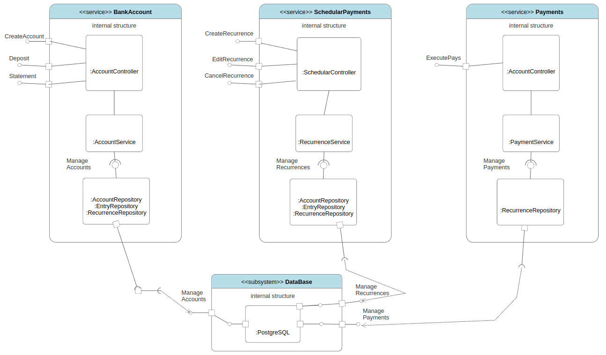

# Banking System *Playground*

### Instruções gerais de execução:

* No diretorio raiz *BankingSystem* execute os seguintes comandos:

***mvn clean package -DskipTests***

***docker-compose up --build***

#### Acesse com um browser a documentação dos endpoints no Swagger:

* bank-account-controller:
***http://localhost:8082/swagger-ui/index.html***

* schedular-payments-controller:
  ***http://localhost:8083/swagger-ui/index.html***

* payments-controller:
  ***http://localhost:8081/swagger-ui/index.html***